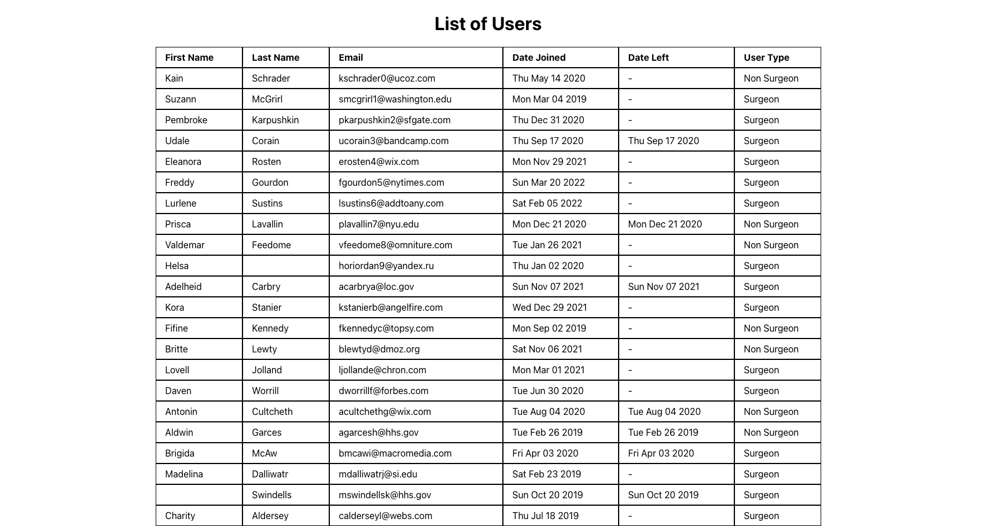
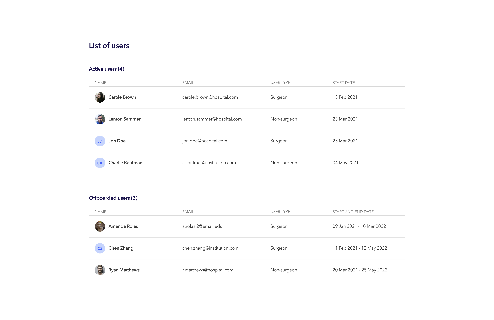

#********* PLEASE READ --------

This is a project I completed for a tech test @ a respectable company I've tried to keep anonymous.

This was step two in the interview process, after submitting ther task I made it to the third and final interview step!

PLEASE NOTE --- The task required me to submit the project 4 hours into dev time regardless of all tasks complete as their goal was to assess how I would tackle a project rather than seeing a complete project. HOWEVER this branch is a snapshot of a couple hours over the 4hour limit which I took upon myself to complete all the tasks.

# ------- EVERYTHING BELOW HERE IS THE TASK 

# **********'s Tech Tests for FrontEnd Recruitment - Kez Anwar

## Before Starting
This repository was created from a template and exists only for your technical test. 

**Kindly leave the main branch as is, and show us your changes as Pull Requests (one or multiple depending on you) to the main branch, so we can easily see the changes you have made, and review them together during our next meeting.**

### Outline
The tasks outlined below are tailored to what we feel is your level of experience/ability based on our first meeting with you. There is no expectation that you finish all the tasks. We ask that you to timebox your work to a **maximum of 4 hours**. The goal for us is not to see the finished code, but instead to get an idea of how you might approach a task, and the different ways you might tackle it. And then to discuss that with you when we meet next time.

This repository contains a directory called `user-list` which is currently a simple React app created using _Create React App_. 
The app pulls some JSON data from a mock API of users, and displays it in a simple table. 
(You can find out more in the `/user-list/README.md` file regarding how to spin up both the mock server & app)

Once both the mock server & app are both running successfully, it should look like this:

As you can see it is very basic, and the challenge (detailed below) for you to tackle is to make some improvements to it both in terms of UX (User Experience) & UI (User Interface).
  
The elements that are important to us in general are things like:
- Coding style
- Architecture
- Readability of your code
  
What is of less importance (given the time constraints) are things like catching every edge case, although we may ask you about what you might do to improve things when we all review the work together, so think about anything you might do to enhance it if you had more time.

Feel free to use any libraries you might find useful throughout your work.

### The Tasks:
_The following tasks can be solved independently in any order_

- #### Redux
    We have a simple list of users being fetched from a mock-server (details in the README.md file within `user-list` directory).
At the moment we fetch the data and simply store it in the local state.
We would like you to convert the app to use [Redux](https://redux.js.org/) to store and retrieve the data as needed.
While it is obviously overkill for this simple example, we would like you to think about implementing this in a more complex app that you and your team will have to maintain for years and the files structures/patterns you might use.

- #### Individual User Page
    We would like you to add the ability to click on an individual user's row and be taken to a page displaying just the data for that user.
You will see there is more data for each user than is displayed in the table on the main page (This like an avatar, job title and city & country) so perhaps consider displaying this extra data.
We use [React Router](https://reactrouter.com/) in our code to handle routing but you can use whatever you like.

- #### Make the List responsive
    At the moment the list is not responsive to being viewed on different sized screens.
We would like you to make it a pleasant experience on mobile as well as desktop and any size screen in between.
We do not necessarily expect to be able to view all the data on small screens so one option to consider would be to hide some of the columns of data or reformat them to make them work better when viewed on a smaller screen.

- #### Make the list sortable
    At the moment the list is just displayed in whatever order the data comes from the API.
We would like you to make the list sortable by a couple of different data points and in different orders (A -> Z & Z -> A or Most Recent to Oldest etc.)

- #### Make the list filterable
    Consider adding a text input that when you type filters the data shown in the table. At a basic level look at first name, last name, and email but if you have time, you could look at filtering by other parameters such as dates.

- #### Adding a User
    The mock API also allows you to interact with it using all the common HTTP methods so add a simple form to enable you to add a new user to the database using a POST request to `/api/users`.
You should be able to enter their First Name, Last Name, Email and if they are a Surgeon or not. It should automatically add today's date as the `date_joined`.

- #### Offboard a User
    The mock API also allows you to interact with it using all the common HTTP methods. Add a button each user row which should “offboard” the user, in this case it should simply add today's date to the `date_left` field rather than deleting the user from the list using a PATCH request to `/api/users/:id`
    
- #### Redesign the UI
    At the moment there is no real design to the table, it is simply rendering the data with a bit of CSS Grid to space it evenly.
We would like you to adapt it to look like the design below but feel free to also add in any improvements if you so choose.
It does not have to be a pixel perfect recreation given the time constraints just see how you get on and do as much as you can.
This does use one of the extra fields in the user object from the API for the Avatar
The list has been split in two into active and offboarded users. This is done purely on whether the user has a leaving date or not.

